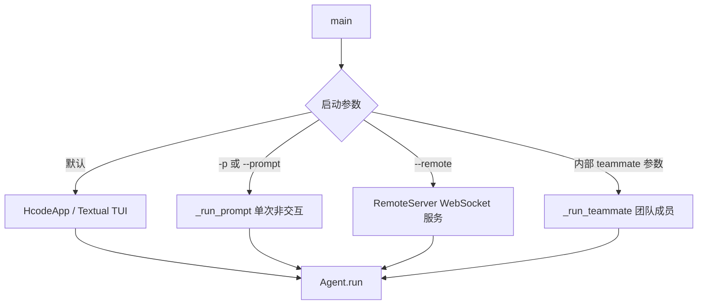
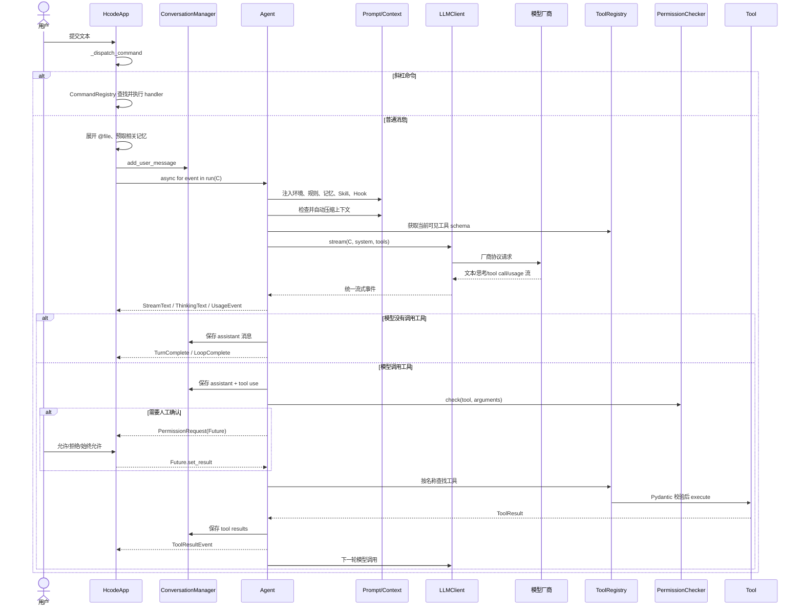

# Hcode 全流程代码解析与阅读指南

> 目标：帮助第一次接触本项目的人先建立完整心智模型，再沿一条真实请求的执行路径阅读源码。
>
> 本文只解释当前代码，不修改实现，也不代替安全审查。已发现的风险、证据与整改优先级见
> [只读代码分析报告](read-only-code-analysis.md)。运行环境和命令见
> [环境配置说明](environment-setup.md)。

## 1. 先用一句话理解项目

Hcode 是一个终端 AI 编程助手：界面层接收用户输入，`Agent` 把项目规则、记忆和会话组装成模型请求，模型可以返回文本或工具调用；工具调用经过权限判断后执行，结果再送回模型，循环到模型给出最终答复为止。

最重要的不是记住每个子包，而是先抓住下面这条主干：

```text
用户输入
  -> TUI / 单次 Prompt / Remote / Teammate 入口
  -> ConversationManager 保存厂商无关的消息
  -> Agent.run() 组装提示词并调用 LLMClient.stream()
  -> 模型输出文本或 ToolUse
  -> PermissionChecker 决策
  -> ToolRegistry 找工具并执行
  -> ToolResult 写回 ConversationManager
  -> 下一轮模型调用
  -> 没有工具调用时结束
```

MCP、Skill、Hook、子 Agent 和团队并没有另起一套运行内核：

- MCP 工具会被包装成普通 `Tool` 并进入 `ToolRegistry`；
- Skill 会变成当前 Agent 的附加提示词，或启动一个隔离 Agent；
- Hook 挂在 `Agent.run()` 的生命周期节点上；
- 子 Agent、团队成员仍然运行同一个 `Agent` 类，只是对话、工具集、权限和工作目录不同；
- Worktree 改变 Agent 的工作目录和 Git 隔离边界，不改变模型循环本身。

## 2. 代码地图

项目使用包根布局，Python 包直接位于 `hcode/`。当前主包包含 13 个功能子包。

| 路径 | 主要职责 | 建议阅读优先级 |
| --- | --- | --- |
| [`hcode/__main__.py`](../hcode/__main__.py) | CLI 参数、四种启动模式、进程级初始化 | 必读 |
| [`hcode/app.py`](../hcode/app.py) | Textual TUI、对象装配、输入分发、事件渲染 | 必读 |
| [`hcode/agent.py`](../hcode/agent.py) | Agent 循环、流式事件、工具执行和权限等待 | 必读 |
| [`hcode/conversation.py`](../hcode/conversation.py) | 厂商无关的消息模型和 token 估算 | 必读 |
| [`hcode/client.py`](../hcode/client.py) | Anthropic、OpenAI Responses、OpenAI 兼容客户端 | 必读 |
| [`hcode/serialization.py`](../hcode/serialization.py) | 内部消息到各厂商请求格式的转换 | 必读 |
| [`hcode/config.py`](../hcode/config.py) | 配置模型、分层加载、环境变量回退 | 必读 |
| [`hcode/prompts.py`](../hcode/prompts.py) | 固定 system prompt、环境上下文和 Plan 提醒 | 第二阶段 |
| [`hcode/tools/`](../hcode/tools/) | 工具抽象、注册表和具体工具 | 第二阶段 |
| [`hcode/permissions/`](../hcode/permissions/) | 权限模式、规则匹配、危险命令和路径边界 | 第二阶段 |
| [`hcode/context/`](../hcode/context/) | 工具结果预算、自动压缩、超限恢复 | 第二阶段 |
| [`hcode/memory/`](../hcode/memory/) | 项目指令、长期记忆、召回、会话持久化 | 第二阶段 |
| [`hcode/commands/`](../hcode/commands/) | 斜杠命令注册、解析和处理器 | 第三阶段 |
| [`hcode/skills/`](../hcode/skills/) | Skill 扫描、解析、执行和安装 | 第三阶段 |
| [`hcode/mcp/`](../hcode/mcp/) | MCP 连接、工具包装和加载策略 | 第三阶段 |
| [`hcode/hooks/`](../hcode/hooks/) | 生命周期 Hook 的匹配和动作执行 | 第三阶段 |
| [`hcode/agents/`](../hcode/agents/) | 子 Agent 定义、fork、后台任务和追踪 | 高级 |
| [`hcode/teams/`](../hcode/teams/) | 团队、邮箱、共享任务和队友后端 | 高级 |
| [`hcode/worktree/`](../hcode/worktree/) | Git worktree 创建、进入、退出和清理 | 高级 |
| [`hcode/filehistory/`](../hcode/filehistory/) | 写入前备份、快照和 rewind | 高级 |
| [`hcode/sandbox/`](../hcode/sandbox/) | Linux/macOS 命令级 OS 沙箱适配 | 高级 |
| [`hcode/remote.py`](../hcode/remote.py) | 浏览器页面、WebSocket 协议和远程事件桥接 | 按需 |
| [`tests/`](../tests/) | 各子系统的行为规格和回归测试 | 与对应模块并读 |

## 3. 进程如何启动

安装后的 `hcode` 命令和 `python -m hcode` 最终都进入
`hcode.__main__:main`。`main()` 先处理内部 teammate 参数，再解析普通 CLI 参数，创建项目下的 `.hcode/` 运行目录，并初始化调试/崩溃日志。

### 3.1 四种运行模式



四条入口最终都使用 `Agent`，但宿主行为并不完全一致：

| 模式 | 输入/输出 | 权限交互 | 主要用途 |
| --- | --- | --- | --- |
| 默认 TUI | Textual 终端界面，保留终端滚动区 | 弹出允许、拒绝、始终允许选择 | 日常人工使用 |
| `-p` | 命令行一次输入，stdout 输出 | 无交互 UI；当前实现会自动回应权限请求 | 脚本、冒烟测试 |
| `--remote` | HTTP 首页 + `/ws` WebSocket | 浏览器把权限答复映射回 Future | 远程浏览器控制 |
| teammate | 团队管理器派生的独立成员进程/任务 | 使用派生权限和独立 worktree | 多 Agent 协作 |

阅读时先看默认 TUI；其余三个模式本质上是在替换“输入从哪里来、事件往哪里去”。

## 4. 配置是怎样进入运行时的

### 4.1 配置合并顺序

`load_config()` 依次加载：

1. 用户级 `~/.hcode/config.yaml`；
2. 项目级 `<cwd>/.hcode/config.yaml`；
3. 项目本地 `<cwd>/.hcode/config.local.yaml`。

后面的层覆盖前面的同名字段。随后 `validate_config_structure()` 把 provider、权限模式、MCP、Hook、fork、verification agent、worktree、teammate、coordinator 和 sandbox 等配置规范化为 `AppConfig`。

### 4.2 Provider 和 API Key

`ProviderConfig` 的核心字段是：

- `protocol`：`anthropic`、`openai` 或 `openai-compat`；
- `model`：发给上游的模型名；
- `base_url`：官方端点或兼容网关；
- `api_key`：可直接配置，也可从环境变量回退；
- `context_window`：显式窗口值或后续推断值。

环境变量映射由 `_ENV_KEY_MAP` 定义：Anthropic 使用 `ANTHROPIC_API_KEY`，OpenAI 和 OpenAI-compatible 使用 `OPENAI_API_KEY`。当前本机的 DeepSeek 配置属于 `openai-compat`，因此执行路径是：

```text
OPENAI_API_KEY
  -> ProviderConfig.api_key 回退
  -> create_client(provider)
  -> OpenAICompatClient
  -> OpenAI Chat Completions 兼容请求
```

代码不会因为厂商名叫 DeepSeek 就寻找 `DEEPSEEK_API_KEY`；它只根据协议选择环境变量。本文不读取或记录真实密钥。

### 4.3 客户端工厂

`create_client()` 按 `protocol` 创建：

- `AnthropicClient`：Anthropic Messages 流式 API；
- `OpenAIClient`：OpenAI Responses API；
- `OpenAICompatClient`：Chat Completions 兼容 API。

三者都实现 `LLMClient.stream()`，并把上游流转换成项目内部统一事件。所以上层 `Agent` 不需要知道当前连接的是 Anthropic、OpenAI 还是 DeepSeek。

## 5. TUI 启动时装配了什么

默认模式创建 `HcodeApp`。Textual 调用 `on_mount()` 后，如果只有一个 provider，程序直接进入 `_select_provider()`；多个 provider 时先显示选择界面。

`_select_provider()` 是理解整个项目依赖关系的最佳入口。它按大致顺序构造：

1. LLM client；
2. `PermissionChecker`、规则引擎和路径沙箱；
3. 可用时给 Bash 工具挂载 OS 级沙箱；
4. 项目指令、`MemoryManager`、`SessionManager` 和 `FileHistory`；
5. 核心工具、Skill 工具、MCP 检索/分发工具、提问和 Plan 工具；
6. 主 `Agent`；
7. `SkillLoader` 和 `SkillExecutor`；
8. `WorktreeManager`；
9. `AgentLoader`、`TaskManager` 和 `AgentTool`；
10. `TeamManager`、团队及协调工具；
11. 后台 MCP 初始化和 worktree 清理任务。

可以把 `HcodeApp` 看成 composition root（对象装配中心）：它负责把各模块接起来，但真正的模型循环仍在 `Agent`。

## 6. 一条用户消息的完整执行链

下面是最值得逐行跟读的一条路径。



### 6.1 输入层

`on_chat_input_submitted()` 读取输入。如果上一次答复仍在流式输出，普通文本会先取消当前任务，再作为新请求分发。`_dispatch_command()` 通过 `parse_command()` 判断：

- 不是 `/` 开头：创建 `_send_message()` 异步任务；
- 是 `/` 命令：从 `CommandRegistry` 找 handler；
- 只有 `/`：列出当前命令。

### 6.2 `_send_message()` 的准备工作

在调用主 Agent 前，TUI 会完成几项宿主级工作：

- 检查并重新加载发生变化的 Skill；
- 等待本次启动的 MCP 初始化完成；
- 展开用户输入中的 `@文件` 引用；
- 使用独立 LLM client 做一次长期记忆相关性选择，设有 8 秒超时；
- 把用户消息写入 `ConversationManager` 和当前 JSONL session；
- 启动记忆 recall 任务并进入流式渲染状态。

随后它遍历 `agent.run()` 产生的事件。TUI 只负责把事件变成界面块；它不决定下一步是否调用工具。

### 6.3 `Agent.run()` 的迭代状态机

`Agent.run()` 是项目核心。每次用户请求最多循环 `max_iterations` 次：

```text
开始一次用户请求
  |
  +-- 注入 environment / instructions / memory / skill catalog
  +-- 运行 session_start、turn_start、pre_send hooks
  +-- 注入团队邮箱通知、Plan/Coordinator 提醒、MCP 延迟工具提示
  +-- build_system_prompt()
  +-- ContextManager.auto_compact()
  +-- registry.get_schemas(protocol)
  +-- client.stream(...)
  |
  +-- 收集 TextDelta / ThinkingDelta / ToolUse / Usage
  |
  +-- 没有 tool call？
  |     +-- 保存最终 assistant 消息
  |     +-- 提取/整理记忆，触发 hooks，创建文件历史快照
  |     +-- LoopComplete，结束
  |
  +-- 有 tool call？
        +-- 保存 assistant tool-use 消息
        +-- 划分并发安全组与串行组
        +-- 权限检查 -> 参数校验 -> 工具执行
        +-- 限制或落盘超大工具结果
        +-- 保存 tool-result 消息
        +-- 回到下一次迭代
```

关键点：模型调用工具以后并没有结束一次用户请求。工具结果必须作为新消息回传给模型，由模型决定继续调用其他工具还是输出最终答复。

### 6.4 流式事件和完整响应

`StreamCollector` 同时完成两件事：

- 把 provider-neutral 的增量事件继续 `yield` 给 UI；
- 在内存中累计本轮完整文本、thinking、tool calls 和 usage，形成 `LLMResponse`。

因此界面可以实时显示文字，而 Agent 在流结束后仍能得到一份结构完整、可保存到会话中的消息。

### 6.5 工具并发规则

`partition_tool_calls()` 只把相邻且标记为并发安全的调用放进同一批。典型读取工具可以并发，写文件和命令类工具保持串行。这样既减少多个独立读取的等待时间，也避免两个写操作互相覆盖或破坏调用顺序。

## 7. 消息为何能跨厂商复用

`ConversationManager` 保存的是内部消息，而不是某家 SDK 的对象。一个 `Message` 可以包含：

- 普通 `content`；
- `ThinkingBlock`；
- 一个或多个 `ToolUseBlock`；
- 一个或多个 `ToolResultBlock`；
- 角色和 token 相关元数据。

真正发请求前，[`serialization.py`](../hcode/serialization.py) 再按协议转换：

| 目标 | 序列化路径 | 工具结果形态 |
| --- | --- | --- |
| Anthropic Messages | `build_anthropic_messages()` | content block 中的 `tool_result` |
| OpenAI Responses | `build_openai_responses_input()` | Responses input item |
| OpenAI-compatible Chat Completions | `build_chat_completion_messages()` | `assistant.tool_calls` + `role=tool` |

DeepSeek 当前走第三条路径。兼容客户端还会识别部分模型返回的 `reasoning_content`，将其转成内部 thinking 事件。

这个边界很重要：

- 修改对话业务语义，优先看 `conversation.py`；
- 修改厂商请求格式，优先看 `serialization.py` 和 `client.py`；
- 不要把某家 SDK 的原生对象泄漏到 `Agent` 或工具层。

## 8. System prompt、项目指令和动态上下文

送给模型的“指令”来自不同层，生命周期也不同。

### 8.1 固定 system prompt

`build_system_prompt()` 使用 `PromptBuilder` 按 priority 拼接身份、任务原则、行动安全、工具使用、语气、输出格式和运行环境。这一部分每轮都要求准确，不参与对话压缩。

Hook 的 prompt 动作成功后，会追加到 `# Hook Injected Context`。

### 8.2 项目指令

`memory/instructions.py` 从工作目录及相关层级加载项目说明文件，并处理 include。装配阶段把结果交给 Agent，Agent 再把它作为对话环境信息注入。

### 8.3 动态环境

`build_environment_context()` 注入当前时间、可用 Skill 目录和 Agent 目录。Plan 模式、coordinator 模式、MCP instructions、团队邮箱通知等，也会以 system reminder 的方式进入当前对话。

可以把最终模型输入理解为：

```text
稳定 system prompt
+ Hook 生成的 system context
+ 内部 ConversationManager 历史
  - 用户/助手消息
  - 工具调用/工具结果
  - 项目指令、长期记忆、Skill、动态提醒
+ 当前可见工具 schemas
```

## 9. 工具系统

### 9.1 统一抽象

所有工具继承 `Tool`，至少定义：

- `name`、`description`；
- Pydantic `params_model`；
- `category`：read、write 或 command；
- `execute(params) -> ToolResult`；
- 是否允许并发的属性。

`ToolRegistry` 负责注册、按名查找、启停工具，以及按当前 provider 协议生成 schemas。

### 9.2 默认核心工具

`create_default_registry()` 注册六个基础能力：

- `ReadFile`
- `WriteFile`
- `EditFile`
- `Bash`
- `Glob`
- `Grep`

`ReadFile`、`WriteFile`、`EditFile` 共享 `FileStateCache`。读取现有文件会记录 mtime；修改现有文件前必须有对应读取状态，用于降低基于旧内容覆盖新变化的概率。写入前还会通知 `FileHistory` 保存备份。

应用装配阶段再加入 Skill、MCP、AskUser、Plan、Worktree、Agent、Team、Task 和消息等扩展工具。

### 9.3 一次工具调用的执行顺序

```text
模型给出 tool name + JSON arguments
  -> ToolRegistry 确认工具存在且启用
  -> PermissionChecker.check(...)
  -> deny：直接生成错误 ToolResult
  -> ask：yield PermissionRequest 并等待 Future
  -> allow：Pydantic model_validate(arguments)
  -> tool.execute(params)
  -> RecoveryState 记录执行情况
  -> ContextManager 限制/持久化超大输出
  -> ToolResultEvent + ConversationManager
```

`ALLOW_ALWAYS` 会尝试把对应规则写入项目本地权限文件。该行为属于权限系统的一部分，而不是工具自身的逻辑。

## 10. 权限系统：五层决策

`PermissionChecker` 综合工具类别、模式、危险命令、路径和规则。适合按以下顺序理解：

1. Plan 模式的特殊限制；
2. 命令安全/危险模式匹配；
3. 可选 OS 沙箱自动放行条件；
4. `PathSandbox` 的工作区和受保护路径判断；
5. `RuleEngine` 的 user/project/local 规则；
6. 当前 `PermissionMode` 默认矩阵；
7. 无法自动决定时返回 `ask`。

主要模式：

| 模式 | 读 | 写 | 命令 |
| --- | --- | --- | --- |
| `default` | 自动允许 | 询问 | 询问 |
| `acceptEdits` | 自动允许 | 自动允许 | 询问 |
| `plan` | 自动允许 | 原则上询问/限制 | 原则上询问/限制 |
| `bypassPermissions` | 自动允许 | 自动允许 | 自动允许 |

规则层合并用户级、项目级和本地规则；冲突时严重性顺序为 `deny > ask > allow`。权限边界存在已知缺陷，尤其不能把“当前测试通过”等同于“安全完备”，具体见[只读代码分析报告](read-only-code-analysis.md)。

## 11. 上下文、压缩和大结果处理

长对话面临两个不同问题：消息历史太大，以及单个工具输出太大。`context/manager.py` 分开处理。

### 11.1 自动压缩

`ConversationManager` 根据已有 API usage 锚点和新消息估算当前 token。接近 `context_window` 阈值时，`ContextManager.auto_compact()`：

1. 选择可压缩的历史前缀；
2. 保留最近消息，并保持 tool-use/tool-result 配对完整；
3. 调模型把前缀总结成摘要；
4. 用“摘要 + 原样尾部”替换内存历史；
5. TUI 把 compact boundary 写入 session，后续 resume 不再重放已压缩前缀。

当模型因 max token/context 错误失败时，还有恢复路径，会附加最近读取文件、已激活 Skill 等恢复状态后重试，并带有熔断限制。

### 11.2 工具结果预算

大工具结果会被截断或写入 `.hcode/sessions/<session-id>/tool-results/`，再把摘要和文件位置返回模型。系统既限制单个结果，也限制一轮所有工具结果的总预算，避免一次搜索或命令输出挤满上下文。

## 12. 记忆、会话和文件历史不是一回事

这三个概念很容易混淆：

| 子系统 | 保存什么 | 主要目录/载体 | 作用范围 |
| --- | --- | --- | --- |
| Conversation | 当前内存消息和 token 锚点 | 进程内 | 当前会话运行态 |
| Session | 用户、助手、工具和 compact boundary 记录 | `.hcode/sessions/*.jsonl` | 退出后可恢复 |
| Long-term Memory | 从对话提取的主题知识 | 用户/项目 memory 目录 | 跨会话召回 |
| FileHistory | 写入前的文件备份和响应快照 | `.hcode/file-history/<session>/` | rewind 文件变化 |

### 12.1 长期记忆路径

发送用户消息前，TUI 会扫描记忆标题，并用一个独立模型请求选择相关条目；选中的内容以 system reminder 注入主对话。回答结束后，主 Agent 可以从本轮抽取新记忆。

`MemoryConsolidator` 是另一条后台 Agent 路径：达到时间和会话数量条件后，它使用独立 Agent 整理记忆主题。它不是每轮同步执行的一部分。

### 12.2 Session 恢复

`Session` 使用 JSONL 追加记录。恢复时重建 provider-neutral 的 `Message`，而不是恢复某家 SDK 对象。thinking 不作为长期恢复的关键内容；工具调用和结果会按内部结构重建。

### 12.3 Rewind

文件工具写入前由 `FileHistory` 保存原内容，完成一次答复后创建快照。`rewind` 根据快照恢复文件。这是项目自己的轻量撤销机制，与 Git commit、branch 或 worktree 无关。

## 13. 斜杠命令

`commands/` 把命令分成三类：

- `LOCAL`：handler 在本机直接执行并更新 UI/状态；
- `LOCAL_UI`：需要宿主界面特殊处理，如清屏或 compact；
- `PROMPT`：handler 生成文本，再作为用户提示交给 Agent。

内置命令包括 clear、compact、help、mcp、memory、plan、review、sandbox、rewind、session、skill、status、tasks、trace 和 worktree。加载器还会扫描用户级与项目级 `.hcode/commands` Markdown 命令，项目定义可覆盖同名用户定义，并替换 `$ARGUMENTS`。

命令不等于 Tool：命令由用户在输入框主动触发，Tool 由模型在生成过程中请求。

## 14. Skill 如何工作

### 14.1 加载

`SkillLoader` 扫描内置、用户和项目 Skill，解析 `SKILL.md` 或 `skill.yaml`，形成 `SkillDef`。目录以 catalog 形式放入 Agent 的动态环境，让模型知道“有哪些 Skill”，但不会一开始把所有正文塞进上下文。

### 14.2 激活

模型调用 `LoadSkill(name)` 或用户执行对应斜杠命令后：

- `mode: inline`：SOP 正文被加入当前 Agent 的 active skills，并作为工具结果返回；
- `mode: fork`：`SkillExecutor` 创建新的 `ConversationManager` 和 `Agent`，按 `none/recent/full` 选择上下文，只把最终结果带回主对话；
- fork 执行器不可用时，`LoadSkill` 有 inline 回退。

所以 Skill 更接近“可按需装载的提示词/工作流”，不是 Python 插件接口。

### 14.3 安装

`InstallSkillTool` 调用 `skills/install.py` 从受支持来源下载到用户级 `~/.hcode/skills/`，并在成功后刷新 loader 和斜杠命令。安装会写文件和访问外部来源，应当与单纯 `LoadSkill` 区分。

## 15. MCP 如何接入统一工具系统

### 15.1 连接和包装

`MCPManager` 读取多个 `MCPServerConfig`，为每个服务器创建 `MCPClient`。客户端支持 stdio 和 HTTP 传输；初始化后读取服务器 instructions 和工具列表。

每个远端工具由 `MCPToolWrapper` 包成项目的 `Tool`：

```text
MCP server tool definition
  -> 动态 Pydantic 参数模型
  -> 名称 mcp__<server>__<tool>
  -> ToolRegistry
  -> 与本地工具相同的权限和 Agent 执行链
```

服务器 instructions 会在首次消息前作为系统提醒注入。

### 15.2 三种 schema 加载策略

MCP 工具很多时，把所有 schema 固定放进请求会占用上下文并破坏缓存。`loading_strategy.py` 在连接完成后选择一次模式，并在整场会话中保持稳定：

| 模式 | 条件 | 模型看到什么 |
| --- | --- | --- |
| `eager` | MCP schema 估算低于 context window 的 10% | 所有 MCP 工具直接进入 `tools[]` |
| `native` | schema 较大且为官方 Anthropic 端点 | defer loading + 原生 ToolSearch |
| `dispatch` | schema 较大且为兼容/代理端点 | 隐藏具体 MCP schema，仅暴露 `ToolSearch` 与 `mcp_call` |

DeepSeek 等 OpenAI-compatible 端点在 schema 较大时会走 `dispatch`。`mcp_call` 根据 server/tool 名在注册表找到被延迟的 wrapper，按原 schema 做参数转换后执行。

## 16. Hook 生命周期

`HookEngine` 的事件模型定义了下面这些关键节点：

```text
session_start
  -> turn_start
  -> pre_send
  -> 模型响应
  -> post_receive
  -> pre_tool_use
  -> 工具执行
  -> post_tool_use
  -> turn_end
  -> session_end
```

Hook 由 event、condition、action、是否异步、是否拒绝工具等字段组成。动作执行器支持 command、prompt、HTTP 和 agent 类型：

- prompt 成功后加入下一次 system prompt 的 Hook context；
- `pre_tool_use` 且配置 reject 时，设计上可以阻止工具；
- 异步 Hook 通过后台 task 执行；
- 执行结果进入通知队列，再转成 `HookEvent` 给 UI。

当前代码有一处必须按实际实现理解的分叉：事件驱动的主 `Agent.run()` 会触发 session/turn/send/receive 类 Hook，但其 `_execute_single_tool_direct()` 和 `_execute_tool()` 路径没有调用 `pre_tool_use`/`post_tool_use`；这两个工具 Hook 当前只接在子 Agent 常用的 `run_to_completion()` → `_execute_tool_noninteractive()` 路径中。因此，不能假定 TUI 主 Agent 的每次工具调用都经过工具 Hook。这是当前实现差异，不是推荐设计。

Hook 是外部副作用和动态指令的重要入口，阅读安全边界时必须和普通 Tool 一起考虑。

## 17. 子 Agent、后台任务和团队

### 17.1 一次性子 Agent

`AgentTool.execute()` 有两条主要路线：

- 指定 `subagent_type`：从 `AgentLoader` 读取定义，创建新的对话和过滤后的工具集；
- 未指定类型且启用 fork：复制父对话上下文，并限制 fork Agent 再次 fork。

子 Agent 可以前台等待，也可以交给 `TaskManager` 后台运行。`TraceManager` 记录 parent、trace、状态和 token 使用。父级权限规则会继承，但子 Agent 可以有自己的权限模式、最大轮数、模型和工具白/黑名单。

### 17.2 团队成员

带 `team_name` 的 `Agent` 工具调用会走 teammate 路径：

1. 找到或创建 `AgentTeam`；
2. 为成员创建独立 Git worktree；
3. 选择 agent 定义和模型；
4. 按 backend 过滤并增加团队协调工具；
5. 创建成员 `Agent`，工作目录指向该 worktree；
6. 注册成员、名称和 trace；
7. 用 tmux、iTerm2 或进程内 backend 启动；
8. 通过 `Mailbox` 和共享 task store 协作。

团队通信是文件持久化邮箱：`SendMessage` 写收件箱，Lead 每轮通过 `notification_fn` 排空通知并注入对话。共享任务由 `TaskCreate/Get/List/Update` 管理。

### 17.3 Coordinator 模式

Coordinator 会把 Lead 的工具集收窄到派发、消息、停止、结束团队等协调能力，避免 Lead 自己读取大量代码占满上下文。真正的代码读取和修改由队友完成。

## 18. Worktree 隔离

`WorktreeManager` 包装 Git worktree 生命周期：创建、进入、退出、列举、恢复 session 和清理陈旧 worktree。

两种常见用途：

- 主 Agent 通过 `EnterWorktree`/`ExitWorktree` 临时切换工作目录；
- 子 Agent 定义或 teammate 要求 `isolation: worktree`，为该任务创建独立目录。

进入后，Agent 的 `work_dir`、路径沙箱和文件工具都应围绕 worktree 路径工作。退出时根据变更、提交和未推送状态决定是否可安全清理。`.hcode` 中还会保存当前 worktree session，供下次启动恢复。

## 19. Remote 模式

`RemoteServer` 自己完成一份较轻的对象装配，然后在同一端口提供：

- `/`：内嵌 Web UI；
- `/ws`：WebSocket；
- 其他路径：404。

浏览器发 `user_message`、`permission_response`、`cancel`、`ping`；服务端把 `AgentEvent` 转成 `stream_text`、`tool_use`、`tool_result`、`permission_request`、`usage`、`loop_complete` 等 JSON 事件广播给客户端。

权限交互仍然使用 `Agent` 创建的 Future，只是 Future 的结果由 WebSocket 消息回填。Remote 模式不是另一套 Agent 协议，而是另一套 UI 适配器。

注意：当前默认监听地址、鉴权和部分能力差异属于高优先级安全问题，使用前应阅读[只读代码分析报告](read-only-code-analysis.md)。

## 20. 运行时数据落在哪里

下面只描述代码约定，不代表所有目录都会在一次运行中出现。

```text
项目目录/
├─ .hcode/
│  ├─ config.yaml                 # 项目配置，可能由用户创建
│  ├─ config.local.yaml           # 更高优先级本地配置
│  ├─ permissions.yaml            # 项目权限规则
│  ├─ permissions.local.yaml      # “始终允许”等本地规则
│  ├─ sessions/                   # JSONL 会话及 <session-id>/tool-results/
│  ├─ file-history/               # 写前备份和 rewind 快照
│  ├─ commands/                   # 项目自定义斜杠命令
│  ├─ skills/                     # 项目 Skill（按 loader 约定）
│  └─ ...                         # plan、worktree session 等状态
├─ hcode/                       # 主包
├─ tests/                         # 测试
└─ docs/                          # 本项目补充文档
```

另有用户级 `~/.hcode/`，可包含用户配置、权限、命令、Skill、Agent 定义和记忆。真实密钥应通过环境变量或受控本机配置注入，不能写入仓库文档或源码。

## 21. 从需求定位源码

| 想改的行为 | 第一入口 | 通常还要看 |
| --- | --- | --- |
| CLI 参数或启动分支 | `hcode/__main__.py` | `config.py`、对应宿主 |
| TUI 输入或渲染 | `hcode/app.py` | `widgets.py`、`commands/` |
| 模型循环/停止条件 | `hcode/agent.py` | `conversation.py`、`context/` |
| 新模型厂商协议 | `hcode/client.py` | `serialization.py`、`config.py` |
| 新本地工具 | `hcode/tools/base.py` | `tools/__init__.py`、permissions、测试 |
| 工具权限 | `hcode/permissions/checker.py` | modes、rules、sandbox、dangerous |
| 长对话压缩 | `hcode/context/manager.py` | `conversation.py`、session |
| 长期记忆 | `hcode/memory/auto_memory.py` | recall、consolidation、app wiring |
| 斜杠命令 | `hcode/commands/registry.py` | handlers、loader、app dispatch |
| Skill | `hcode/skills/` | `tools/load_skill.py`、app wiring |
| MCP | `hcode/mcp/` | ToolRegistry、ToolSearch、mcp_call |
| Hook | `hcode/hooks/` | `agent.py` 的调用节点 |
| 子 Agent | `hcode/tools/agent_tool.py` | `agents/`、tool_filter、permissions |
| 团队 | `hcode/teams/manager.py` | mailbox、shared_task、spawn、AgentTool |
| Worktree | `hcode/worktree/manager.py` | enter/exit tools、commands |
| Remote UI | `hcode/remote.py` | `web_content.py`、Agent events |

## 22. 推荐阅读顺序

不要从目录首字母顺序通读。按下面四轮读，认知负担更低。

### 第一轮：只建立主链路

1. `pyproject.toml`：确认入口和依赖；
2. `hcode/__main__.py`：只看 `main()` 和默认分支；
3. `hcode/app.py`：看 `on_mount()`、`_select_provider()`、`_dispatch_command()`、`_send_message()`；
4. `hcode/agent.py`：重点看事件 dataclass、`StreamCollector`、`Agent.run()`；
5. `hcode/conversation.py`：理解内部消息。

读完应能回答：“用户敲回车以后，最终为什么可能执行文件工具？”

### 第二轮：模型和工具边界

1. `client.py` 的 `LLMClient`、`create_client()` 和当前使用的 `OpenAICompatClient`；
2. `serialization.py` 的 Chat Completions 路径；
3. `tools/base.py`、`tools/__init__.py`；
4. `read_file.py`、`write_file.py`、`edit_file.py`、`bash.py`；
5. `permissions/checker.py`、`modes.py`、`rules.py`、`sandbox.py`。

读完应能回答：“模型给出的 JSON 参数，经过哪些判断才真正碰到文件系统？”

### 第三轮：状态和扩展

1. `context/manager.py`；
2. `memory/session.py`、`auto_memory.py`、`recall.py`；
3. `commands/`；
4. `skills/`；
5. `mcp/`；
6. `hooks/`。

读完应能回答：“对话为什么可以变长、恢复、按需增加能力？”

### 第四轮：并行协作和隔离

1. `tools/agent_tool.py`；
2. `agents/loader.py`、`fork.py`、`task_manager.py`、`tool_filter.py`；
3. `teams/manager.py`、`mailbox.py`、`shared_task.py`、`spawn_inprocess.py`；
4. `worktree/manager.py`；
5. 最后按需阅读 `remote.py`。

读完应能回答：“子 Agent 与主 Agent 共享什么，又隔离了什么？”

## 23. 用测试反向验证理解

测试不仅用于回归，也是一组可执行的行为说明。建议边读模块边读对应测试：

| 主题 | 测试文件 |
| --- | --- |
| Agent 主循环、工具迭代 | `test_agent.py`、`test_streaming_batching.py` |
| 消息配对和厂商序列化 | `test_conversation_pairing.py`、`test_serialization.py` |
| 权限和恢复 | `test_permissions.py`、`test_recovery.py` |
| 上下文窗口和压缩 | `test_context.py`、`test_context_window.py` |
| 文件编辑 | `test_edit_file.py`、`test_diff.py` |
| Memory | `test_memory.py`、`test_memory_recall_wiring.py`、`test_consolidation.py` |
| Skill | `test_skills.py` |
| MCP | `test_mcp.py`、`test_mcp_call.py`、`test_tool_search.py` |
| Hook | `test_hooks.py` |
| 子 Agent | `test_subagent.py` |
| Team | `test_teams.py`、`test_team_protocol.py`、`test_coordinator_multi_team.py` |
| Worktree | `test_worktree.py` |

环境已完成的基线是 `685 passed, 3 skipped`。这证明当前测试描述的行为成立，但不证明未覆盖的安全边界没有问题。

## 24. 读完后应掌握的十个问题

如果能不看本文回答下面问题，就已经掌握了项目主干：

1. `python -m hcode` 如何进入 Textual TUI？
2. DeepSeek 为什么读取 `OPENAI_API_KEY`？
3. `ConversationManager` 为什么不直接保存 OpenAI message？
4. `Agent.run()` 在什么条件下进入下一轮？
5. 工具参数在哪里校验，权限在哪里判断？
6. 为什么多个 Read 可以并发，而 Write/Edit 保持串行？
7. auto compact 如何避免拆散 tool-use/tool-result？
8. Session、Memory 和 FileHistory 分别解决什么问题？
9. MCP、Skill 和子 Agent 怎样复用现有 Agent/Tool 抽象？
10. TUI、Remote 和单次 Prompt 模式共享什么、各自负责什么？

建议下一步按“第一轮”阅读顺序打开源码，在 `Agent.run()` 旁边手工画一次“文本响应”和一次“工具响应”的分支；这是理解整个项目收益最高的一次阅读。
